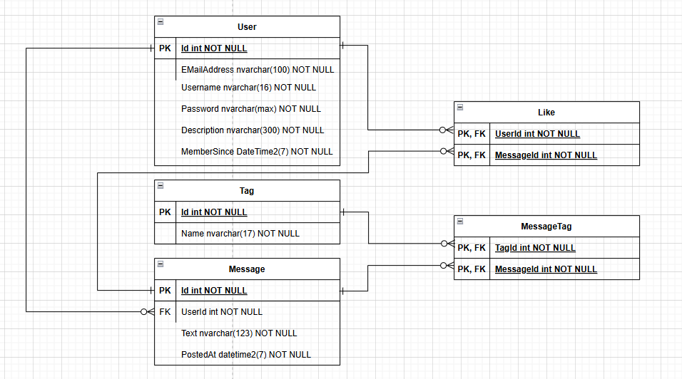

# Dokumentation

## Home-Controller

Beinhaltet die Logik, um Posts zu liken und Posts zu erstellen. Posts und die Top 5 Hasshtags der letzten 24 Stunden werden angezeigt.

## Account-Controller

Beinhaltet sämtliche Logik um Benutzer zu erstellen und sich einloggen zu können. Darüber hinaus befindet dich die Logik für die Profilansicht in diesem Controller.

## Javascript

In der globalen Javascript-Datei werden die Hashtags mittel Regex farblich hervorgehoben.

## Datenbankdiagramm

